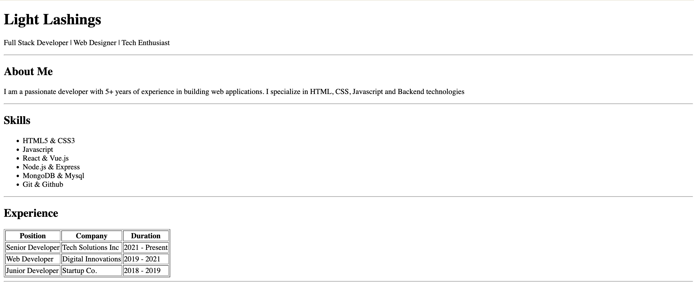
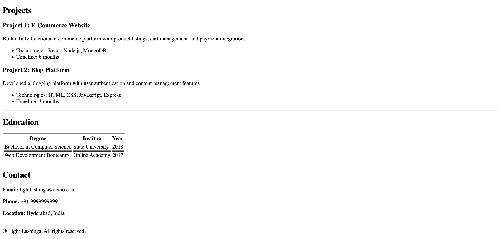

# Portfolio Website

This is a simple static portfolio website built using plain HTML.  
It showcases personal details, skills, work experience, projects, education, and contact information.

---

## 🚀 Features
- Clean and simple HTML structure
- Sections for About, Skills, Experience, Projects, and Education
- Uses basic HTML elements like tables, lists, and headings
- No external libraries or frameworks

---

## Technologies Used
- HTML5

---

## How to Run
1. Clone the repository or download the files
2. Open `index.html` in any web browser

---
## Portfolio Demo

